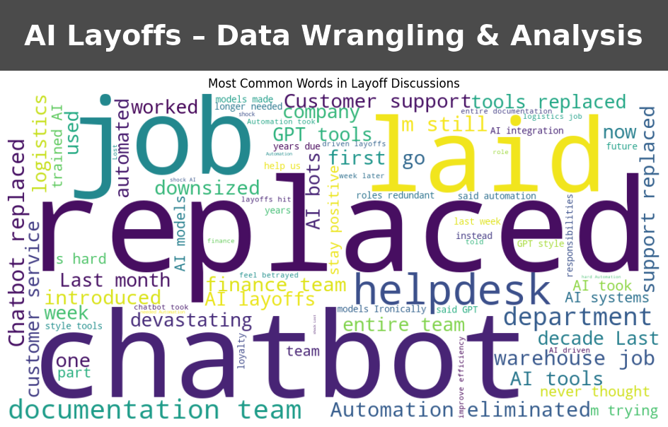

# 📊 Data Wrangling & Analysis – AI-Related Layoffs Project

## 📌 Project Overview
This project investigates **the economic and emotional impact of AI-related job losses** by integrating structured corporate layoff data with unstructured social media discussions from Reddit.  

The objective was to **collect, clean, merge, and prepare** these datasets for further analysis — demonstrating **data wrangling, cleaning, and integration skills** essential for real-world data science and analytics roles.

---

## 🎯 Key Highlights
- ✅ **Multi-source data integration**: Combined public layoff records with Reddit discussion threads for richer context.
- ✅ **Comprehensive cleaning**: Removed duplicates, standardized formats, handled missing values, and filtered for AI-related layoffs.
- ✅ **Exported clean dataset** for future sentiment analysis, trend forecasting, and reporting.
- ✅ **Reproducible workflow** in Jupyter Notebook with clear documentation and reusable code.

---

## 📂 Datasets
1. **Layoffs Dataset** (`layoffs.csv`)  
   - Source: Layoffs.fyi  
   - Fields: `company`, `date`, `industry`, `total_laid_off`, `percentage_laid_off`, `country`, etc.

2. **Reddit Layoffs Dataset** (`reddit_layoffs_ai_2023_2025.csv`)  
   - Source: Reddit (r/layoffs, r/cscareerquestions)  
   - Fields: `post_title`, `post_text`, `date_posted`, `subreddit`.

3. **Final Combined Dataset** (`combined_cleaned_dataset.csv`)  
   - Merged layoffs and Reddit sentiment data for AI-related layoffs.

---

## 🛠 Tools & Technologies
- **Python** – Data cleaning & wrangling
- **Pandas & NumPy** – Data manipulation & transformation
- **Jupyter Notebook** – Workflow documentation & execution
- **Regex** – Pattern matching for text filtering
- **CSV I/O** – Data import/export
- **HTML Export** – Project report sharing

---

## 🧹 Data Wrangling Process
1. **Data Import** – Loaded raw CSV files into Pandas DataFrames.
2. **Exploration & Profiling** – Checked dataset shapes, types, and missing values.
3. **Cleaning Steps**:
   - Removed duplicate records.
   - Standardized date formats.
   - Converted text fields to lowercase for consistency.
   - Filtered posts mentioning AI-related job losses.
4. **Merging** – Joined datasets on relevant fields to provide both quantitative (layoff numbers) and qualitative (employee sentiment) insights.
5. **Export** – Saved cleaned, combined dataset for analysis.

---

## 📊 Potential Analyses & Applications
- **Sentiment Analysis** – Measure emotional tone in Reddit posts related to AI layoffs.
- **Trend Analysis** – Identify peaks in layoffs correlated with AI adoption events.
- **Industry Impact Reports** – Provide insight into sectors most affected by AI-driven workforce changes.

---

## 🚀 How to Reproduce
1. **Clone the repository**:
   ```bash
   git clone https://github.com/YOUR-USERNAME/data-wrangling-project.git
   cd data-wrangling-project
   ```

2. **Install dependencies**:
   ```bash
   pip install pandas numpy
   ```

3. **Open and run the Jupyter Notebook**:
   ```bash
   jupyter notebook Data_Wrangling_Project_Starter.ipynb
   ```

4. **View the HTML report** for a non-technical presentation:
   - Open `Data_Wrangling_Project_Starter.html` in your browser.

---

## 📈 Project Impact
This project shows the ability to:
- Work with **real-world messy data** from multiple sources.
- Apply **ETL (Extract, Transform, Load)** best practices.
- Prepare datasets for advanced analytics, such as **machine learning** and **business intelligence**.
- Communicate findings to both **technical** and **non-technical** audiences.

---

## 📜 License
This project is for educational purposes. Data sources belong to their respective owners.

---
**💼 Ideal for:** Data Analyst, Data Scientist, Business Intelligence, and Cloud Data roles.
